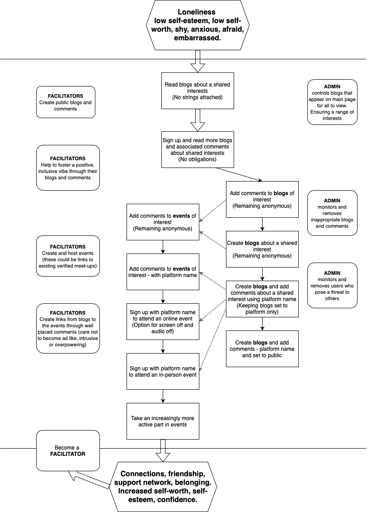

# Project Name
Developers: Team name (Joy Zadan, Georgina Carlisle, Radleigh Smith, Callum Jepps, Edison Kwan, Eduard Viorel Stan)

Image showcasing project to go here

Project currently under development and no live link available.

## Contents

[Design](#design)

- [The Strategy Plane](#the-strategy-plane)

- [The Scope Plane](#the-scope-plane)

- [The Structure Plane](#the-structure-plane)

- [The Skeleton Plane](#the-skeleton-plane)

- [The Surface Plane](#the-surface-plane)

[Agile Methodology](#agile-methodology)

[Features](#features)

- [Existing Features](#existing-features)

- [Future Features](#future-features)

[Languages](#languages)

[Tools and Technologies](#tools-and-technologies)

[Testing and Validation](#testing-and-validation)

[Bugs and Fixes](#bugs-and-fixes)

[Deployment](#deployment)

[Credits](#credits)

[Acknowledgements](#acknowledgements)

---

## Design

### The Strategy Plane

#### Project Theme

This project is being created for the “Talking Tech: Men’s Health Reimagined” Movember Hackathon and will focus on Men’s **mental health**.

#### Research into Men's Mental Health

There is clear and well evidenced research showing:

-	Men’s mental health is a very real and current issue.

-	Men are at higher risk of suicide that women, in particular men aged 40-49.

-	There are clear links between loneliness and poorer physical health.

-	There are clear associations between loneliness and poorer mental health.

-	Loneliness is an area where more needs to be done.

However, there is little current research around how loneliness is most effectively tackled. With the suggestion that a 
> range of approaches may be required, tailored to fit people’s individual experiences of loneliness and contexts. 

Detailed account of research

[Mental Health Foundation](https://www.mentalhealth.org.uk/explore-mental-health/a-z-topics/men-and-mental-health)

The above website provided key insight into men’s mental health with our takeaways from the information being:
-	Men’s mental health is a very real and current issue. 
-	Three times as many men as women die by suicide.
-	Men aged 40 to 49 have the highest suicide rates in the UK.
-	Men are less likely to access psychological therapies than women.
-	A range of underlying factors make it harder for men to reach out for help and open up.
-	Men may also be more likely to use potentially harmful coping methods (example: drugs, alcohol, escapism) and less likely to talk to family or friends about their mental health.
-	Positively research suggest men will get the help that meets their preferences and is easy, meaningful and engaging.

[Suicide risk factors for middle aged men](https://www.samaritans.org/about-samaritans/research-policy/middle-aged-men-suicide/suicide-risk-factors-middle-aged-men/)

The above document provided further insight into the research around why Men aged 40 to 49 have the highest suicide rates. Key takeaways:
-	In terms of age, gender and socio-economic status, the group most at risk of suicide are middle-aged men from disadvantaged backgrounds.
-	Factors that play a role in suicide risk include: personality traits, masculinity, challenges of mid-life, relationship breakdown, emotional illiteracy and socio-economic factors.
-	Suicide prevention policy and practice must take account of men’s beliefs, concerns and context.
-	Recognition that for men in mid-life, **loneliness is a very significant cause of their high risk of suicide**, and (prevention policy and practice must) **enable men to strengthen their social relationships**.

[Tackling loneliness evidence review: main report](https://www.gov.uk/government/publications/tackling-loneliness-evidence-review/tackling-loneliness-evidence-review-full-report#what-we-know-and-what-we-do-not-know-about-loneliness)

The above document (updated March 2023), which is mainly geared towards building the evidence around loneliness summarised what the **current research** shows. Key quotes from the document:
‘Indeed, there is now **exhaustive work linking loneliness to poorer physical health** during adulthood.’
‘There is now cross-sectional evidence to support the **association between loneliness and a range of psychiatric disorders**, including anxiety, depression, and psychosis, and to support an **association between loneliness and suicidal thoughts and behaviour**.’
‘Evidence from a systematic review and meta-analysis shows **loneliness is a significant predictor of both suicidal ideation and behaviour, with depression potentially the link between loneliness and suicidal ideation/behaviour** (McLelland et al., 2020)’.

The document also went into current research about the effectiveness and acceptability of interventions to address loneliness and mental health problems:
‘Available evidence about the determinants of loneliness in people with mental health problems suggest a **range of approaches may be required, tailored to fit people’s individual experiences of loneliness and contexts. For some, loneliness is strongly linked to social isolation and lack of supportive social contact; for others; psychological factors including perceived social threat and sense of belongingness are important drivers of loneliness.** Different intervention options to meet these needs are desirable.’
However:
“In most cases what we have are preliminary studies that show approaches are feasible and acceptable, but do not provide definitive evidence.”

#### Project Focus

Our team has chosen to focus on the need for innovation in how we can tackle loneliness, designing a solution tailored towards men and taking into account their preferences and the barriers they may face.

It is to be noted that there are two sides to loneliness:

-	social isolation and lack of supportive social contact

-	psychological factors including perceived social threat and sense of belongingness

Our solution will initial be focused on providing an innovation solution to tackling social isolation and lack of supportive social contact. Once the platform is in use and has been scaled up, the next area of growth will focus on how the platform can be used to tackle the psychological factors associated with isolation.

#### Target User Group

Men with a special focus towards men aged 40-49. 

Note, while this is the target user group it is important that the project created remains open to all.

#### Problem Statement

“I am a man aged 40 – 49 experiencing loneliness due to social isolation and a lack of supportive social contact. I feel shy, anxious about connecting with others and embarrassed to reach out and ask for help. My loneliness is a contributing factor in my decreasing physical and mental health and is also increasing my risk factor for suicide.”

#### Project Aim

“When the leap is too great, step by step the impossible becomes achievable. Supporting men across the chasm from loneliness to connection, friendship and belonging, through shared interests.”

The flow chart shows how users might negotiate that chasm step by step through our site.

[Return to contents list](#contents)

---

### The Scope Plane

[Return to contents list](#contents)

---

### The Structure Plane

[Return to contents list](#contents)

---

### The Skeleton Plane

[Return to contents list](#contents)

---

### The Surface Plane

[Return to contents list](#contents)

## Agile Methodology

Agile values and principles have been followed in the creation of this project. In particular the following common Agile practices have been followed:

- user stories
- product backlog
- prioritization
- information radiators
- iteration cycles

[Return to contents list](#contents)

## Features

### Existing Features

[Return to contents list](#contents)

### Future Features

[Return to contents list](#contents)

## Languages

[Return to contents list](#contents)

## Tools and Technologies

[GitHub](https://github.com/) - Stores the repository for this project so that it can be contributed to by all members of the team. A number of github tools were also used to aid Agile development.

[git](https://git-scm.com/) - Controlled the building of this project in a series of versions which can be tracked.

[Visual Studio Code](https://code.visualstudio.com/) - The editor in which this project was built. 

[Return to contents list](#contents)

## Testing and Validation

[Return to contents list](#contents)

## Bugs and Fixes

[Return to contents list](#contents)

## Deployment

[Return to contents list](#contents)

## Credits

[Return to contents list](#contents)

## Acknowledgements

[Return to contents list](#contents)
