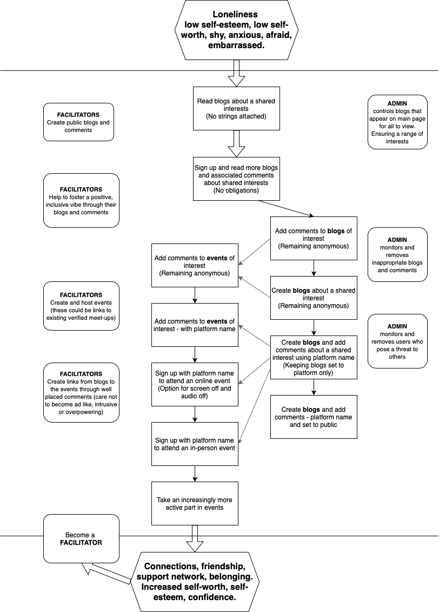
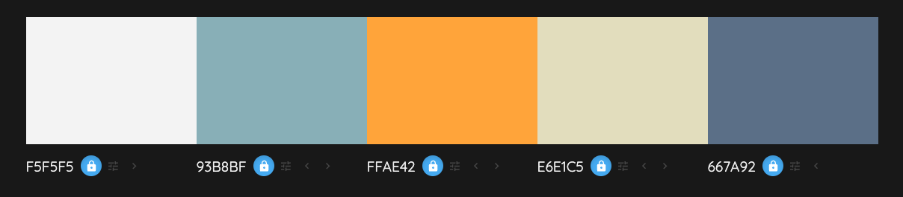
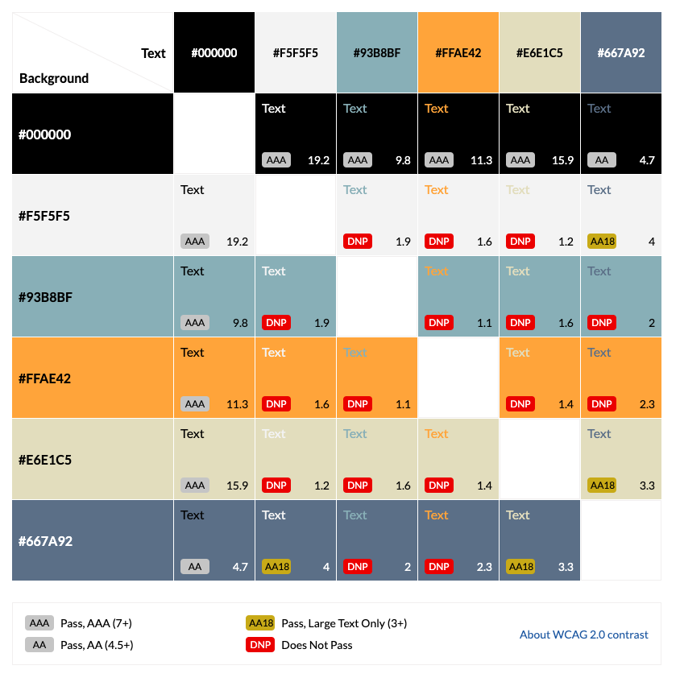

# BroBonds
Developed by Team!Alone:
[Joy Zadan](https://github.com/JoyZadan)
[Eduard Viorel Stan](https://github.com/EddieStn)
[Georgina Carlisle](https://github.com/GeorginaCarlisle)
[Radleigh Smith](https://github.com/RadleighSmith)
[Callum Jepps](https://github.com/CJepps)
[Edison Kwan](https://github.com/edisonkwan18)

Image showcasing project to go here

Live link: https://movember1-bac9d403956e.herokuapp.com/

## Contents

[Design](#design)

- [The Strategy Plane](#the-strategy-plane)

- [The Scope Plane](#the-scope-plane)

- [The Structure Plane](#the-structure-plane)

- [The Skeleton Plane](#the-skeleton-plane)

- [The Surface Plane](#the-surface-plane)

[Agile Methodology](#agile-methodology)

[Features](#features)

- [Existing Features](#existing-features)

- [Future Features](#future-features)

[Languages](#languages)

[Tools and Technologies](#tools-and-technologies)

[Testing and Validation](#testing-and-validation)

[Bugs and Fixes](#bugs-and-fixes)

[Deployment](#deployment)

[Credits](#credits)

[Acknowledgements](#acknowledgements)

---

## Design

### The Strategy Plane

#### Project Theme

This project is being created for the “Talking Tech: Men’s Health Reimagined” Movember Hackathon and will focus on Men’s **mental health**.

#### Research into Men's Mental Health

There is clear and well evidenced research showing:

-	Men’s mental health is a very real and current issue.

-	Men are at higher risk of suicide that women, in particular men aged 40-49.

-	There are clear links between loneliness and poorer physical health.

-	There are clear associations between loneliness and poorer mental health.

-	Loneliness is an area where more needs to be done.

However, there is little current research around how loneliness is most effectively tackled. With the suggestion that a 
> range of approaches may be required, tailored to fit people’s individual experiences of loneliness and contexts. 

Detailed account of research

[Mental Health Foundation](https://www.mentalhealth.org.uk/explore-mental-health/a-z-topics/men-and-mental-health)

The above website provided key insight into men’s mental health with our takeaways from the information being:
-	Men’s mental health is a very real and current issue. 
-	Three times as many men as women die by suicide.
-	Men aged 40 to 49 have the highest suicide rates in the UK.
-	Men are less likely to access psychological therapies than women.
-	A range of underlying factors make it harder for men to reach out for help and open up.
-	Men may also be more likely to use potentially harmful coping methods (example: drugs, alcohol, escapism) and less likely to talk to family or friends about their mental health.
-	Positively research suggest men will get the help that meets their preferences and is easy, meaningful and engaging.

[Suicide risk factors for middle aged men](https://www.samaritans.org/about-samaritans/research-policy/middle-aged-men-suicide/suicide-risk-factors-middle-aged-men/)

The above document provided further insight into the research around why Men aged 40 to 49 have the highest suicide rates. Key takeaways:
-	In terms of age, gender and socio-economic status, the group most at risk of suicide are middle-aged men from disadvantaged backgrounds.
-	Factors that play a role in suicide risk include: personality traits, masculinity, challenges of mid-life, relationship breakdown, emotional illiteracy and socio-economic factors.
-	Suicide prevention policy and practice must take account of men’s beliefs, concerns and context.
-	Recognition that for men in mid-life, **loneliness is a very significant cause of their high risk of suicide**, and (prevention policy and practice must) **enable men to strengthen their social relationships**.

[Tackling loneliness evidence review: main report](https://www.gov.uk/government/publications/tackling-loneliness-evidence-review/tackling-loneliness-evidence-review-full-report#what-we-know-and-what-we-do-not-know-about-loneliness)

The above document (updated March 2023), which is mainly geared towards building the evidence around loneliness summarised what the **current research** shows. Key quotes from the document:
‘Indeed, there is now **exhaustive work linking loneliness to poorer physical health** during adulthood.’
‘There is now cross-sectional evidence to support the **association between loneliness and a range of psychiatric disorders**, including anxiety, depression, and psychosis, and to support an **association between loneliness and suicidal thoughts and behaviour**.’
‘Evidence from a systematic review and meta-analysis shows **loneliness is a significant predictor of both suicidal ideation and behaviour, with depression potentially the link between loneliness and suicidal ideation/behaviour** (McLelland et al., 2020)’.

The document also went into current research about the effectiveness and acceptability of interventions to address loneliness and mental health problems:
‘Available evidence about the determinants of loneliness in people with mental health problems suggest a **range of approaches may be required, tailored to fit people’s individual experiences of loneliness and contexts. For some, loneliness is strongly linked to social isolation and lack of supportive social contact; for others; psychological factors including perceived social threat and sense of belongingness are important drivers of loneliness.** Different intervention options to meet these needs are desirable.’
However:
“In most cases what we have are preliminary studies that show approaches are feasible and acceptable, but do not provide definitive evidence.”

#### Project Focus

Our team has chosen to focus on the need for innovation in how we can tackle loneliness, designing a solution tailored towards men and taking into account their preferences and the barriers they may face.

It is to be noted that there are two sides to loneliness:

-	social isolation and lack of supportive social contact

-	psychological factors including perceived social threat and sense of belongingness

Our solution will initial be focused on providing an innovation solution to tackling social isolation and lack of supportive social contact. Once the platform is in use and has been scaled up, the next area of growth will focus on how the platform can be used to tackle the psychological factors associated with isolation.

#### Target User Group

Men with a special focus towards men aged 40-49. 

Note, while this is the target user group it is important that the project created remains open to all.

#### Problem Statement

“I am a man aged 40 – 49 experiencing loneliness due to social isolation and a lack of supportive social contact. I feel shy, anxious about connecting with others and embarrassed to reach out and ask for help. My loneliness is a contributing factor in my decreasing physical and mental health and is also increasing my risk factor for suicide.”

#### Project Aim

To create a plaform where men can come together and connect with others over shared interests. They will be able to create and comment on blog posts and sign up to online and in-person events. 

Uniquely, the platform will be designed to provide as few as possible barriers for men initially joining the platform (no expectations and the option to remain anonymous). As they grow more comfortable and at ease on the platform they can choose to start contributing and become more visible. When ready, they can then take the next steps into asking questions about events and then signing up and going along. 

#### Mission Statement

“When the leap is too great, step by step the impossible becomes achievable. Supporting men across the chasm from loneliness to connection, friendship and belonging, through shared interests.”

The flow chart below plans how users might negotiate that chasm step by step through our site.

[Return to contents list](#contents)

---

### The Scope Plane

The scope of this project is provided by user stories, organised below by epic and then role.

#### EPIC - General User Account

As a new user I can register for an account so that I can access registered user only content and create and comment on blogs.

As a registered user I can use my username and password to login to my account so that my account remains secure and only I can login.

As a signed-in user I can easily logout of my account so that I can keep my account secure.

As a registered user I can reset my password so that I can still log into my account if I forget my password

As a signed-in user I can access and edit my profile information so that I can make changes or add additional preference or information.

As a site admin I can remove accounts so that I can prevent unsuitable users from accessing and using the platform.

As a signed-in user I can click on the picture of a fellow user and bring up there about me information so that I can get to know my fellow user

#### EPIC - Facilitator Account

As a registered user I can apply to become a facilitator so that I can support other users, contribute to the platform and create and host events.

As a site admin I can authorise an application to become a facilitator so that I can ensure only suitable users can become facilitators.

#### EPIC - Visiting User Experience

As a new user I can understand what this website is about and the potential value I can gain from it so that I can decide whether I would like to explore the site further and sign up.

As a new user I can read blog posts about a range of interests so that I can gain an idea of the value I might gain by registering for the platform.

As a user I can contact the site owner so that provide feedback or ask any questions I may have.

As a new user I can read frequently asked questions so that I can find out the answers to some of my questions and concerns.

As a new user I can find out who created this platform and why so that I can understand more about what this platform is about and who it was created by.

#### EPIC - Navigation

As a new user I can navigate easily and intuitively to all available content so that I can quickly find what I need.

As a signed-in user I can navigate easily and intuitively to all registered user content so that I can quickly find what I am looking for.

#### EPIC - Blogs

As a signed in user I can view all blogs so that read and find out about different areas of interest.

As a signed-in user I can create a blog so that I can share information about something that interests me.

As a signed-in user I can edit a blog I have created so that I fix any mistakes or make changes.

As a signed-in user I can search the blogs by entering a key term so that I can find specific blogs.

As a signed-in I can view blogs in order of preference based on my interests so that I am shown the blogs most relevant to me first.

As a signed-in user I can filter the blogs according to different options so that I can control the order in which the blogs are shown.

As a site admin I can remove blogs so that I can ensure only positive and relevant blogs are available on the platform.

#### EPIC - Blog Commenting

As a signed-in user I can view all comments associated with a blog so that follow the conversation.

As a signed-in user I can comment on blogs so that I can share my thoughts and contribute.

As a signed-in user I can edit any comments that I have made so that I can fix any mistakes made when posting.

As a signed-in user I can delete any of my comments so that I can change my mind and remove my comment.

As a site admin I can remove comments so that I can ensure the platform remains positive and respectful, was comments inline with the purpose of the platform.

#### EPIC - Events

As a Signed-in user I can view all events so that I see what is coming up.

As a signed-in user I can view events ordered to show my preferences and events close to me first so that I can view the most relevant events first.

As a signed-in user I can choose how to filter and order events so that I can control the order in which the events are shown.

As a signed-in user I can use keywords to search for specific events so that I can locate specific events.

As a signed-in user I can comment on events so that I can ask questions about the event, pass on positive reviews, or let others know I'm thinking of attending.

As a signed-in user I can sign up to attend events so that I can let the organisers know I wish to attend.

As a facilitator I can create and post events so that I can provide opportunities for users to meet and connect through a shared interest.

As a facilitator I can edit event details so that I can fix a mistake or update information should things change.

As a facilitator I can delete events I created so that I remove the details from a past event, or an event that has been cancelled.

As a facilitator I can view a list of users who have signed up to the event so that I know how many people might turn up and who.

As a site admin I can remove events so that I can remove past events, events that may pose a threat or events not inline with the aim of the platform.

As a site admin I can remove event comments so that I can ensure the platform remains positive and respectful.

[Return to contents list](#contents)

---

### The Structure Plane

[Return to contents list](#contents)

---

### The Skeleton Plane

#### Wireframes

Before diving into development, our project harnessed wireframing techniques to meticulously structure the platform's user interface. These wireframes formed the bedrock of our design, mapping out the strategic placement of essential elements and interactions. This early visualization of the layout played a crucial role in refining the user experience, guaranteeing intuitive navigation and seamless interaction for our users. This systematic approach not only guided our development efforts but also paved the way for crafting a polished, user-centric platform interface.

#### Desktop

* Home page

***
* Blog / Events Page

***
* Upload Blog / Event Page

***
* Registration Page

***
* Login Page

***
* Account Page

***

#### Mobile

During UI design, our focus on mobile convenience didn't compromise the desktop experience. We implemented a responsive design approach that seamlessly accommodates both mobile and desktop users. The relocation of the navigation bar to the bottom for mobile usage didn't hinder the functionality or accessibility on desktop. This approach ensured that users, regardless of their device, could navigate the site with ease, offering a consistent and intuitive experience across various platforms.

* Home Page mobile

***
* Blog / Events Page mobile

***
* Upload Blog / Event Page mobile

***
* Registration Page mobile

***
* Login Page Mobile

***
* Account Page Mobile

[Return to contents list](#contents)

---

### The Surface Plane

#### Typography

##### Headings: Kanit

We've chosen Kanit for our headings to infuse a sense of modernity and elegance into our platform. Kanit's clean and stylish appearance adds visual interest to headers, making them stand out while maintaining readability and professionalism.

##### Body Text: Roboto

For the body text, we've opted for Roboto for its excellent readability across various screen sizes. Roboto's clean and versatile style ensures a comfortable reading experience for users, enhancing content legibility and clarity throughout the platform.

Our choice of Kanit for headings and Roboto for body text from [Google Fonts](https://fonts.google.com/) aims to establish a consistent and unified typographic style. This deliberate selection ensures a seamless visual flow, guiding users through content effortlessly while presenting a cohesive and refined interface.

#### Color Scheme

Our platform is designed as a vibrant and welcoming space, dedicated to fostering connections and combatting loneliness through shared interests. The choice of colours plays a pivotal role in crafting this user experience. The background, adorned with #f5f5f5, sets the backdrop, ensuring content clarity. Headers and footers feature #93B8BF, imbuing a sense of coherence and continuity throughout the platform. To prompt actions and engagements, #FFAE42 energizes the calls to action, inviting users to participate actively in the community. The hero text container, highlighted in #e6e1c5 against hero images, evokes warmth and readability, drawing attention to key messages. Within cards showcasing blogs and events, #667a92 infuses a touch of elegance to titles, adding visual interest and aiding in content categorization. Finally, #000 delivers crisp and legible text, ensuring readability across all interactions, fostering a seamless and engaging experience.

[Colormind.io](http://colormind.io/) played a crucial role in our colour selection process. We used its tools to explore different combinations, aiming for colours that feel inviting, coherent, and engaging. After trying various options, we settled on a palette that reflects our commitment to fostering connections and combating loneliness. These colours blend well, offering a balance between calming backgrounds and vibrant elements like call-to-action prompts, ensuring readability and visual appeal throughout the platform. Colormind.io was instrumental in helping us create a cohesive and inviting visual identity that aligns with our platform's mission.

Ensuring accessibility and readability for all users is paramount. We utilized [contrast-grid.eightshapes.com](https://contrast-grid.eightshapes.com/) to evaluate and fine-tune our colour choices. By assessing the contrast ratios, we confirmed that our selected palette meets accessibility standards, guaranteeing clear legibility and visual clarity across our platform. This tool enabled us to verify that our colour combinations maintain adequate contrast, supporting inclusivity and a seamless user experience for everyone.

[Return to contents list](#contents)

## Agile Methodology

Agile values and principles have been followed in the creation of this project. In particular the following common Agile practices have been followed:

- user stories
- product backlog
- prioritization
- information radiators
- iteration cycles

[Return to contents list](#contents)

## Features

### Existing Features

The existing features provide the following project requirements:

### Project Name
[image of project]

The project name is displayed consistently at the top of all three pages.

### Footer
[image of long]
[image of short]

The footer is displayed at the bottom of all pages. It has been styled to be sticky. All footer links open in a new tab

The footer includes:
- Photo of every team member
- LinkedIn profile of every team member
- The purpose of the website

### Landing page

There are two landing pages. One is before login and one is after login.

#### Landing page (Before Login)
[image of before]

#### Landing page (After Login)
[image of after]

The landing page includes:
- A short introductory paragraph of BroBonds
- A short slogan to call
- Static image of Hero image for welcome
- Clearly visible buttons to access the signup page
- 3 cards present ‘Latest Blog’, ‘Popular Blog’ & ‘Latest Event’

### Sign-up page
[image of signup]

The sign-up includes:
- A short paragraph of declaration to confirm users are 18 years old or above
- A clear link will refer to login page if users have their account.
- A field for users to fill their email address

- A field for users to setup their username (The name show on blog and event)
- A field for users to setup their password
- A field for users to fill their preset password for validation
- Clearly visible buttons to submit the signup form

### Favicon and page titles
[image of favicon]

A favicon has been included and each page has a different title.

### About us page
[image of about]

The About us page includes:
- 3 paragraphs to introduce BroBonds
- Static image of mens talk

### FAQ page
[image of faq]

TheFAQ  page includes:
- 6 paragraphs to explain questions asked frequently by user

### Log in page
[image of log in]

The Log in page includes:
- A clear link will refer to sign up page if users need to sign up their account.
- A field for users to fill their user name
- A field for users to fill their password
- A checkbox to memorize the user log in data
- Clearly visible buttons to submit the form then direct to landing page after log in

### Password reset page
[image of password reset]

The Password reset page includes:
- A field for users to fill their email address
- Clearly visible buttons to submit the form then password reset email will be sent to corresponding email address

### After user log in

### My Profile page
[image of my profile]

The my profile page includes:
- A user profile image
- User alias to display if they want to be anonymous
- Image file upload for the user profile image
- A field for users to fill their about me information 
- Check to decide to be anonymous (tick = anonymous)
- Clearly visible buttons to submit the form

### Blog list page
[image of blog list]

The blog list page includes:
- Clearly visible buttons to create the blog
- A search function field to search blog with keyword
- Blogs showing detail as below
- Blog title
- Author
- Content
- Create time
- Number of Like
- Number of Comments
- List of interests
- Clearly visible buttons to view the entire blog

### Blog page
[image of blog]

The blog page includes:
- Static image of the blog
- Blog title
- Author & create time
- List of interests
- Content of the blog
- Number of Like and comments
- Clearly visible buttons to like the blog
- Comments section if users leave comment and it will show
- Leave comment section with the name of posting and comment
- Clearly visible buttons to submit the blog

### Create Blog page
[image of create blog]

The create blog page includes:
- A field for users to fill the title of the blog
- A field for users to fill the content of the blog
- A field for users to fill the interests related to the blog
- A field for users to upload the image related to the blog
- Clearly visible buttons to submit the blog

### Get Together
### Event list page
[image of event list]

The create blog page includes:
- Event title
- Image of the event
- Organizer
- Categorry of interests
- Event type: Face to Face / Hybird / Virtual
- Event date
- Event time
- Location
- Description
- Maximum Participants
- Signup Deadline
- Community members who already registered
- Clearly visible buttons to join the event

### Create event page
[image of create event]

The create blog page includes:
User can fill detail below
- Event title
- Categorry of existing interests
- Categorry of new interests
- Image of the event
- Organizer
- Event type: Face to Face / Hybird / Virtual
- Event date
- Event time
- Location
- Description
- Maximum Participants
- Signup Deadline
- Community members who already registered
- Clearly visible buttons to join the event

[Return to contents list](#contents)

### Future Features

[Return to contents list](#contents)

## Languages

[Return to contents list](#contents)

## Tools and Technologies

[GitHub](https://github.com/) - Stores the repository for this project so that it can be contributed to by all members of the team. A number of github tools were also used to aid Agile development.

[git](https://git-scm.com/) - Controlled the building of this project in a series of versions which can be tracked.

[Visual Studio Code](https://code.visualstudio.com/) - The editor in which this project was built. 

[Return to contents list](#contents)

## Testing and Validation

[Return to contents list](#contents)

## Bugs and Fixes

[Return to contents list](#contents)

## Deployment

[Return to contents list](#contents)

## Credits

* [Uizard.io](https://uizard.io/) for facilitating intuitive wireframing and seamless UX design.

[Return to contents list](#contents)

## Acknowledgements

[Return to contents list](#contents)
