# Project Name
Developers: Team name (Joy Zadan, Georgina Carlisle, Radleigh Smith, Callum Jepps, Edison Kwan, Eduard Viorel Stan)

Image showcasing project to go here

Project currently under development and no live link available.

## Contents

[Design](#design)

- [The Strategy Plane](#the-strategy-plane)

- [The Scope Plane](#the-scope-plane)

- [The Structure Plane](#the-structure-plane)

- [The Skeleton Plane](#the-skeleton-plane)

- [The Surface Plane](#the-surface-plane)

[Agile Methodology](#agile-methodology)

[Features](#features)

- [Existing Features](#existing-features)

- [Future Features](#future-features)

[Languages](#languages)

[Tools and Technologies](#tools-and-technologies)

[Testing and Validation](#testing-and-validation)

[Bugs and Fixes](#bugs-and-fixes)

[Deployment](#deployment)

[Credits](#credits)

[Acknowledgements](#acknowledgements)

---

## Design

### The Strategy Plane

#### Target User Group

#### Problem Background

#### Problem Statement

#### Project Aim

[Return to contents list](#contents)

---

### The Scope Plane

[Return to contents list](#contents)

---

### The Structure Plane

[Return to contents list](#contents)

---

### The Skeleton Plane

#### Wireframes

Before diving into development, our project harnessed wireframing techniques to meticulously structure the platform's user interface. These wireframes formed the bedrock of our design, mapping out the strategic placement of essential elements and interactions. This early visualization of the layout played a crucial role in refining the user experience, guaranteeing intuitive navigation and seamless interaction for our users. This systematic approach not only guided our development efforts but also paved the way for crafting a polished, user-centric platform interface.

#### Desktop

* Home page

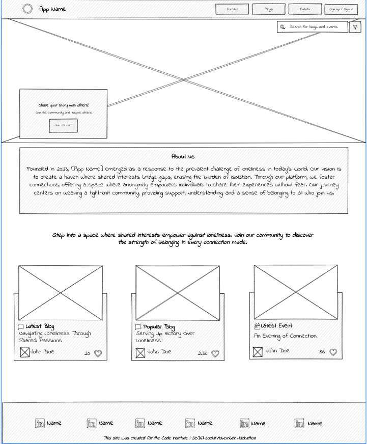

***
* Blog / Events Page

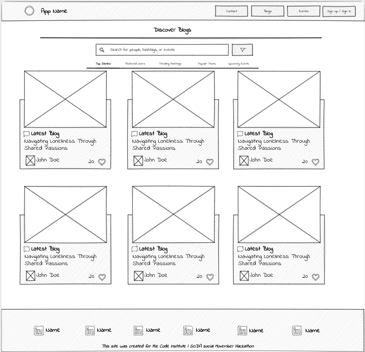

***
* Upload Blog / Event Page

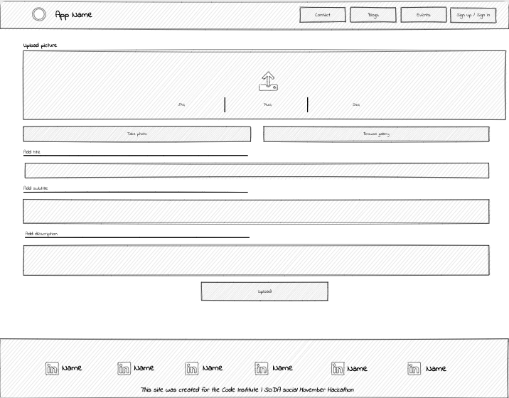

***
* Registration Page

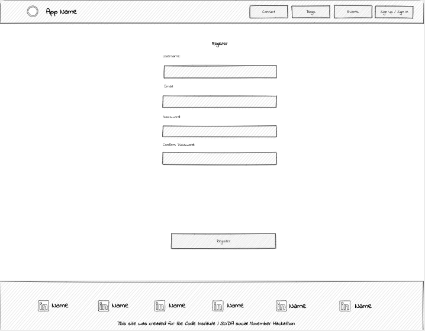

***
* Login Page

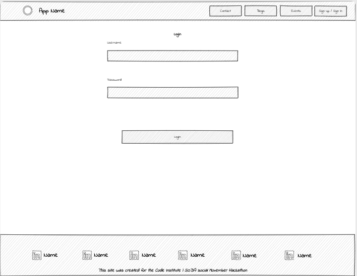

***
* Account Page

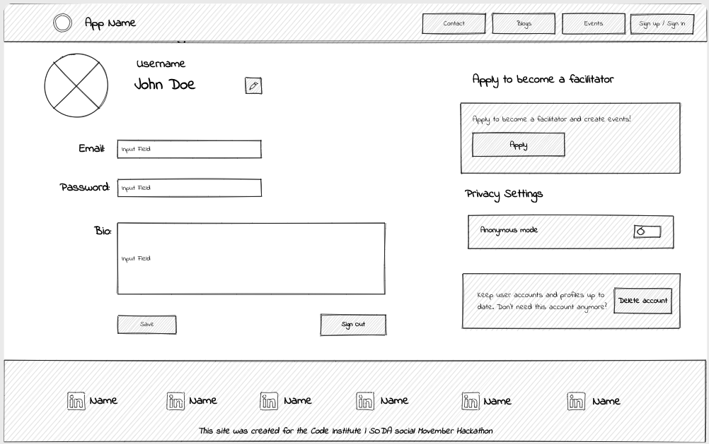

***

#### Mobile

During UI design, our focus on mobile convenience didn't compromise the desktop experience. We implemented a responsive design approach that seamlessly accommodates both mobile and desktop users. The relocation of the navigation bar to the bottom for mobile usage didn't hinder the functionality or accessibility on desktop. This approach ensured that users, regardless of their device, could navigate the site with ease, offering a consistent and intuitive experience across various platforms.

* Home Page mobile

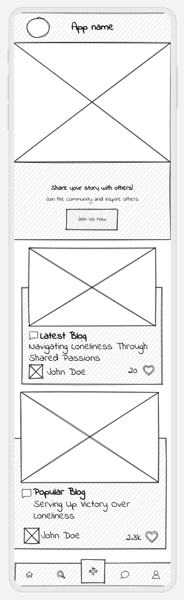

***
* Blog / Events Page mobile

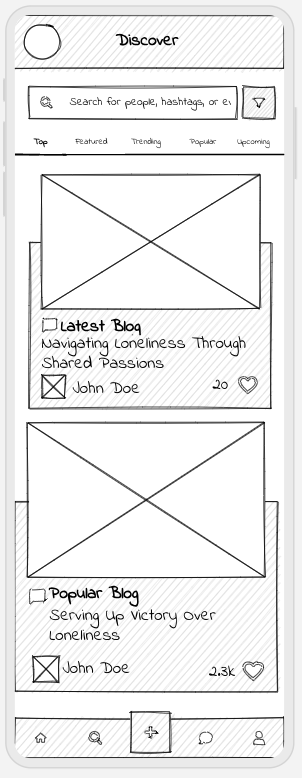

***
* Upload Blog / Event Page mobile

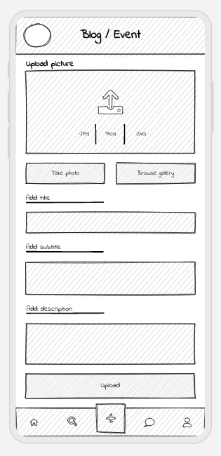

***
* Registration Page mobile

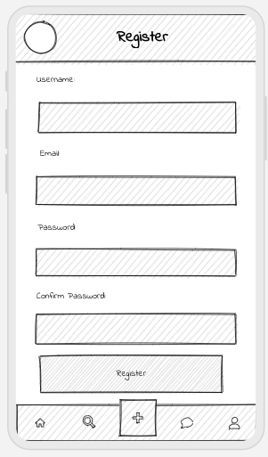

***
* Login Page Mobile

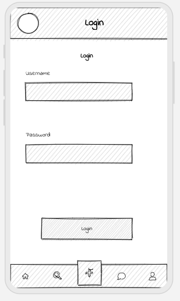

***
* Account Page Mobile

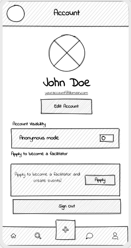

[Return to contents list](#contents)

---

### The Surface Plane

[Return to contents list](#contents)

## Agile Methodology

Agile values and principles have been followed in the creation of this project. In particular the following common Agile practices have been followed:

- user stories
- product backlog
- prioritization
- information radiators
- iteration cycles

[Return to contents list](#contents)

## Features

### Existing Features

[Return to contents list](#contents)

### Future Features

[Return to contents list](#contents)

## Languages

[Return to contents list](#contents)

## Tools and Technologies

[GitHub](https://github.com/) - Stores the repository for this project so that it can be contributed to by all members of the team. A number of github tools were also used to aid Agile development.

[git](https://git-scm.com/) - Controlled the building of this project in a series of versions which can be tracked.

[Visual Studio Code](https://code.visualstudio.com/) - The editor in which this project was built. 

[Return to contents list](#contents)

## Testing and Validation

[Return to contents list](#contents)

## Bugs and Fixes

[Return to contents list](#contents)

## Deployment

[Return to contents list](#contents)

## Credits

* [Uizard.io](https://uizard.io/) for facilitating intuitive wireframing and seamless UX design.

[Return to contents list](#contents)

## Acknowledgements

[Return to contents list](#contents)
